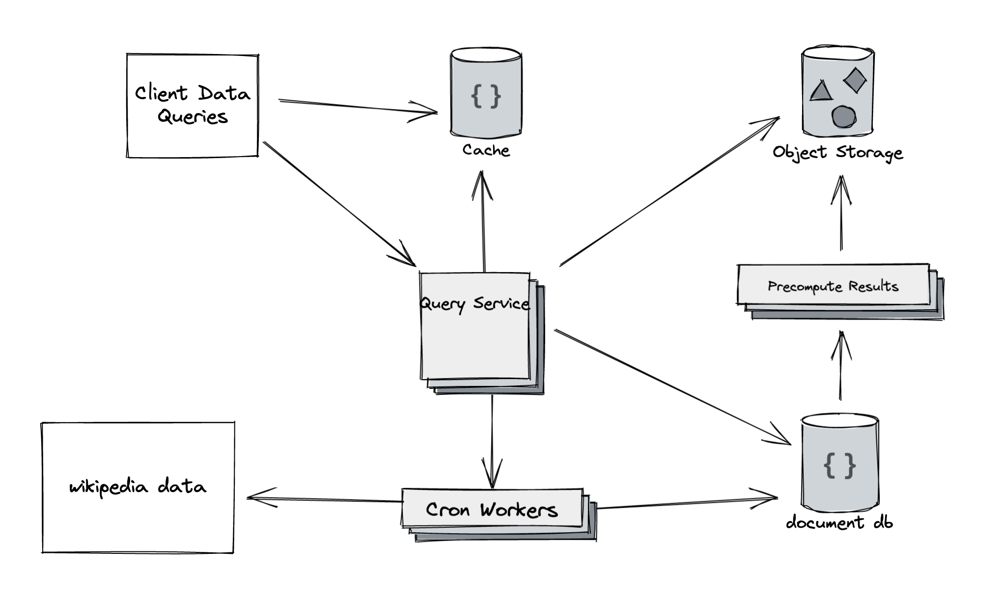

### Setup:

Build the image:

`docker build . --tag "top-wiki-pages"`

Run the container:

`docker run -t -d --rm --name wikipages top-wiki-pages `

Exec into the container:

`docker exec -ti wikipages bash`

### Tests

Within the container in the working directory, run:

`./vendor/bin/phpunit --testsuite project`

### Usage:

If you don't provide any arguments, it will query the current date and hour. The wikipedia data for the current hour may not be available yet.

`php main.php`

You can query for a specific date and hour:

`php main.php 2022-02-01 12`

You can query for a range of results:

`php main.php 2022-02-01 12 --end-date=2022-02-02 --end-hour=12` 

Keep in mind, that for any results you have not previously generated, the data for each hour will need to be downloaded before results can be generated. So providing a large range could potentially take a very long time depending on your internet speed.

### Discussion:
#### Production Setting Improvements and Additions
For deploying this to a production setting, the improvements I would make are:
- Load the page view data from Wikipedia into a database for further querying later on.
- Having all the page view data in a database permanently will give us flexibility if the problem changes. What if we want to sort our results differently? Or change how were querying the data? This would invalidate all of our precomputed results.
- Heavily cache the results for any queries. Since the data we ingest never changes, this is ripe for caching.
- Considering this particular problem, we could precompute results for each hour and store the files in an object storage for clients to download.
- Add a CI/CD pipeline.

#### Testing
The test suite for something of this scope is fairly simple. Currently, the core thing
we need to test is if we can take a page view file and transform that into another file.
I would continue to expand on the test suite here currently, as its fairly basic.
One benefit of loading all our page view data into a database is testing would be
improved and much easier. We could rely on database queries instead of parsing files (and writing 
tests for those transformations) every time we need to create an
aggregate of our data.

#### Changes if Needed to Run Every Hour
If we needed to generate the result set every hour, the most straightforward solution
would put this command on a cron job that runs every hour. The current amount of data
this processes per hour is pretty small, so this solution would suffice. If we needed 
this to scale to far greater data volumes, I think the biggest bottleneck would be
network bandwidth. Wikipedia makes the data for the hour available all at once, so we will
always need to download it before we can process it.
